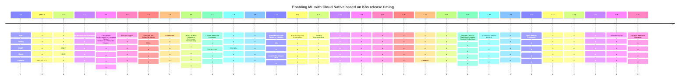

```mermaid
timeline
    title Enabling ML with Cloud Native based on K8s release timing
    0.0 : K8s
        : Tooling
        : CNCF
        : Cloud
        : Platform
    pre-1.0 : a
        : a
        : a
        : a
        : Amazon ECS
    1.0 : a
        : a
        : CNCF
        : GKE
        : a      
    1.1 : Jobs<br/>HPA<br/>Daemonsets
        : a
        : a
        : a
        : a
    1.2 : ConfigMaps Deployments<br/>Ingress Custom Metrics<br/>Persistent Volumes
        : a
        : a
        : a
        : a
    1.3 : NVIDIA Support
        : a
        : a
        : a
        : a
    1.4 : StorageClass Schedule Affinity
        : Helm
        : a
        : a
        : a
    1.5 : StatefulSets
        : a
        : a
        : a
        : a
    1.6 : RBAC Multible Schedlers Accelerator Normalizating
        : a
        : a
        : a
        : a
    1.7 : Custom Resource Defintions
        : a
        : CNCF KCSP
        : a
        : a
    1.8 : a
        : a
        : K8s SIGs
        : a
        : a
    1.9 : a
        : a
        : a
        : a
        : a
    1.10 : Node Metrics Node Resource Controls
         : Istio
         : a
         : Azure AKS, Amazon EKS
         : a
    1.11 : Pod Priority Pod Preemption
         : a
         : a
         : a
         : a
    1.12 : Scaling Improvements
         : a
         : a
         : a
         : a
    1.13 : a
         : a
         : a
         : a
         : a
    1.14 : a
         : a
         : a
         : a
         : a
    1.15 : a
         : a
         : a
         : a
         : a
    1.16 : a
         : a
         : a
         : a
         : a
    1.17 : a
         : a
         : a
         : a
         : Kubeflow
    1.18 : a
         : a
         : a
         : a
         : a
    1.19 : Storage Capacity Tracking Immutable Secrets ConfigMaps
         : a
         : a
         : a
         : a
    1.20 : Accelerator Metrics (broken)
         : a
         : a
         : a
         : a
    1.21 : a
         : a
         : a
         : a
         : a
    1.22 : QOS Memory Resources
         : a
         : a
         : a
         : a
    1.23 : a
         : a
         : a
         : a
         : a
    1.24 : a
         : a
         : a
         : a
         : a
    1.25 : a
         : a
         : a
         : a
         : a
    1.26 : Schedule GPUs
         : a
         : a
         : a
         : a
    1.27 : Dynamic Resource Allocation
         : a
         : a
         : a
         : a
```
