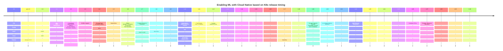

```mermaid
timeline
    title Enabling ML with Cloud Native based on K8s release timing
    0.0 : K8s
        : Tooling
        : CNCF
        : Cloud
        : Platform
    pre-1.0 : <br>
        : <br>
        : <br>
        : <br>
        : Amazon ECS
    1.0 : <br>
        : <br>
        : CNCF
        : GKE
        : <br>   
    1.1 : Jobs<br>HPA<br>Daemonsets
        : <br>
        : <br>
        : <br>
        : <br>
    1.2 : ConfigMaps<br>Deployments<br>Ingress<br>Custom Metrics<br>Persistent Volumes
        : <br>
        : <br>
        : <br>
        : <br>
    1.3 : NVIDIA Support
        : <br>
        : <br>
        : <br>
        : <br>
    1.4 : StorageClass<br>Schedule Affinity
        : Helm
        : <br>
        : <br>
        : <br>
    1.5 : StatefulSets
        : <br>
        : <br>
        : <br>
        : <br>
    1.6 : RBAC<br>Multible Schedulers<br>Accelerator Normalizating
        : <br>
        : <br>
        : <br>
        : <br>
    1.7 : Custom Resource Defintions
        : <br>
        : CNCF KCSP
        : <br>
        : <br>
    1.8 : <br>
        : <br>
        : K8s SIGs
        : <br>
        : <br>
    1.9 : <br>
        : <br>
        : <br>
        : <br>
        : <br>
    1.10 : Node Metrics<br>Node Resource Controls
         : Istio
         : <br>
         : Azure AKS<br>Amazon EKS
         : <br>
    1.11 : Pod Priority<br>Pod Preemption
         : <br>
         : <br>
         : <br>
         : <br>
    1.12 : Scaling Improvements
         : <br>
         : <br>
         : <br>
         : <br>
    1.13 : <br>
         : <br>
         : <br>
         : <br>
         : <br>
    1.14 : <br>
         : <br>
         : <br>
         : <br>
         : <br>
    1.15 : <br>
         : <br>
         : <br>
         : <br>
         : <br>
    1.16 : <br>
         : <br>
         : <br>
         : <br>
         : <br>
    1.17 : <br>
         : <br>
         : <br>
         : <br>
         : Kubeflow
    1.18 : <br>
         : <br>
         : <br>
         : <br>
         : <br>
    1.19 : Storage Capacity Tracking<br>Immutable Secrets and ConfigMaps
         : <br>
         : <br>
         : <br>
         : <br>
    1.20 : Accelerator Metrics (broken)
         : <br>
         : <br>
         : <br>
         : <br>
    1.21 : <br>
         : <br>
         : <br>
         : <br>
         : <br>
    1.22 : QOS Memory Resources
         : <br>
         : <br>
         : <br>
         : <br>
    1.23 : <br>
         : <br>
         : <br>
         : <br>
         : <br>
    1.24 : <br>
         : <br>
         : <br>
         : <br>
         : <br>
    1.25 : <br>
         : <br>
         : <br>
         : <br>
         : <br>
    1.26 : Schedule GPUs
         : <br>
         : <br>
         : <br>
         : <br>
    1.27 : Dynamic Resource Allocation
         : <br>
         : <br>
         : <br>
         : <br>
    1.28 : <br>
         : <br>
         : <br>
         : <br>
         : <br>
    1.29 : <br>
         : <br>
         : <br>
         : <br>
         : <br>
    1.30 : <br>
         : <br>
         : <br>
         : <br>
         : <br>
```
