```mermaid
timeline
    title Enabling ML with Cloud Native based on K8s release timing
    0.0 : K8s
        : Tooling
        : CNCF
        : Cloud
        : Platform
    pre-1.0 : <br>
        : <br>
        : <br>
        : <br>
        : Amazon ECS
    1.0 : <br>
        : <br>
        : CNCF
        : GKE
        : <br>   
    1.1 : Jobs<br>HPA<br>Daemonsets
        : <br>
        : <br>
        : <br>
        : <br>
    1.2 : ConfigMaps<br>Deployments<br>Ingress<br>Custom Metrics<br>Persistent Volumes
        : <br>
        : <br>
        : <br>
        : <br>
    1.3 : NVIDIA Support
        : <br>
        : <br>
        : <br>
        : <br>
    1.4 : StorageClass<br>Schedule Affinity
        : Helm
        : <br>
        : <br>
        : <br>
    1.5 : StatefulSets
        : <br>
        : <br>
        : <br>
        : <br>
    1.6 : RBAC<br>Multible Schedulers<br>Accelerator Normalizating
        : <br>
        : <br>
        : <br>
        : <br>
    1.7 : Custom Resource Defintions
        : <br>
        : CNCF KCSP
        : <br>
        : <br>
    1.8 : <br>
        : <br>
        : K8s SIGs
        : <br>
        : <br>
    1.9 : <br>
        : <br>
        : <br>
        : <br>
        : <br>
    1.10 : Node Metrics<br>Node Resource Controls
         : Istio
         : <br>
         : Azure AKS<br>Amazon EKS
         : <br>
    1.11 : Pod Priority<br>Pod Preemption
         : <br>
         : <br>
         : <br>
         : <br>
    1.12 : Scaling Improvements
         : <br>
         : <br>
         : <br>
         : <br>
    1.13 : <br>
         : <br>
         : <br>
         : <br>
         : <br>
    1.14 : <br>
         : <br>
         : <br>
         : <br>
         : <br>
    1.15 : <br>
         : <br>
         : <br>
         : <br>
         : <br>
    1.16 : <br>
         : <br>
         : <br>
         : <br>
         : <br>
    1.17 : <br>
         : <br>
         : <br>
         : <br>
         : Kubeflow
    1.18 : <br>
         : <br>
         : <br>
         : <br>
         : <br>
    1.19 : Storage Capacity Tracking<br>Immutable Secrets and ConfigMaps
         : <br>
         : <br>
         : <br>
         : <br>
    1.20 : Accelerator Metrics (broken)
         : <br>
         : <br>
         : <br>
         : <br>
    1.21 : <br>
         : <br>
         : <br>
         : <br>
         : <br>
    1.22 : QOS Memory Resources
         : <br>
         : <br>
         : <br>
         : <br>
    1.23 : <br>
         : <br>
         : <br>
         : <br>
         : <br>
    1.24 : <br>
         : <br>
         : <br>
         : <br>
         : <br>
    1.25 : <br>
         : <br>
         : <br>
         : <br>
         : <br>
    1.26 : Schedule GPUs
         : <br>
         : <br>
         : <br>
         : <br>
    1.27 : Dynamic Resource Allocation
         : <br>
         : <br>
         : <br>
         : <br>
    1.28 : <br>
         : <br>
         : <br>
         : <br>
         : <br>
    1.29 : <br>
         : <br>
         : <br>
         : <br>
         : <br>
    1.30 : <br>
         : <br>
         : <br>
         : <br>
         : <br>
```

| Kubernetes Release | Feature Added | Impact on ML/AI Workloads | Cloud Provider ML Release | ML/AI Technique Highlight | Popular ML Software Release | Tools on Kubernetes | Popular LLM and ML Software | Supported and Largest Cluster Size |
|-|-|-|-|-|-|-|-|-|
| 1.1 | Jobs, HPA, DaemonSets | Enhanced batch processing, auto-scaling, and node management. | | | | | | Supports ~1000 nodes, Largest ~1000 nodes |
| 1.2 | Config Maps, Deployments, Ingress, Custom Autoscaling Metrics, Persistent Volumes | Improved configuration management, rollout, traffic routing, custom scaling, and storage. | | | | | | |
| 1.3 | NVIDIA GPU support (alpha) | Enabled GPU acceleration for ML/AI workloads. | AWS GPU instances for ML/AI (2016) | Convolutional Neural Networks (CNNs) | TensorFlow 1.0 (2017) | | | Supports ~2000 nodes, Largest ~2000 nodes |
| 1.4 | StorageClass, Affinity | Improved storage management and workload placement.| | | | | | |
| 1.5 | StatefulSets | Managed stateful applications crucial for ML workloads. | | | | | | |
| 1.6 | RBAC, Multiple Schedulers, Normalize Accelerators (not just NVIDIA) | Scalability, security, custom scheduling, and broader accelerator support. | | | | | | Supports ~5000 nodes, Largest ~5000 nodes |
| 1.7 | Custom Resource Definitions (CRDs) | Enabled custom resource management for ML frameworks. | | | | | | |
| 1.8 | SIGs are created, Workloads API (Stable) | Community engagement and stabilized workload APIs. | Google Cloud TPUs (2017) | Generative Adversarial Networks (GANs) | | Kubeflow 0.1 (2018) | | |
| 1.9 | Initializers (Alpha) | Simplified custom resource initialization. | | | | | | |
| 1.10 | Node Metrics/Controls, Topology-aware volume scheduling| Improved resource monitoring and storage efficiency.| | | | | | |
| 1.11 | Pod Priority and Preemption, CoreDNS as default DNS | Better resource allocation and efficient DNS resolution. | | | | | | |
| 1.12 | Scaling/Scheduling Improvements | Enhanced overall scalability and scheduling efficiency. | | | | | | |
| 1.14 | Taint-based Evictions | Improved node management and workload placement. | | | | | | |
| 1.15 | Extended Resource Tolerations | Enhanced flexibility in resource allocation. | | | | | | |
| 1.19 | Storage Capacity Tracking, Immutable Secrets and ConfigMaps | Improved storage management and security. | AWS Sagemaker (2017) | Transformers | PyTorch 1.0 (2018) | | BERT (2018) | |
| 1.20 | Accelerator Metrics | Enhanced monitoring of accelerator performance. | | | | | | |
| 1.22 | QoS for Memory Resources | Better quality of service for memory-intensive workloads.| | | | | | |
| 1.26 | Schedule GPUs | Improved GPU management and scheduling. | | | | K8sGPT | | |
| 1.27 | Dynamic Resource Allocation | Enhanced resource utilization and flexibility. | | | | KubeRay (2022) | ChatGPT (2022) | |
